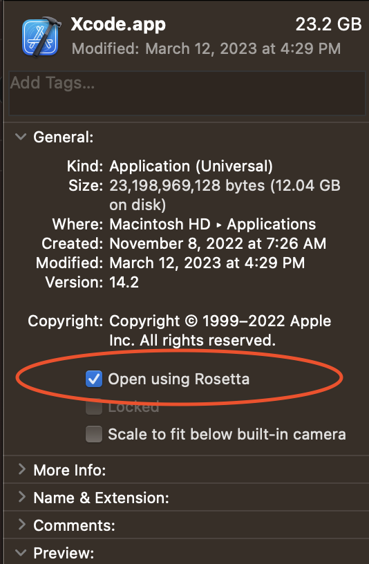

# dsnp-wallet-swift

## Installation

M1 Macs:

There is a known issue regarding some crypto related dependencies not running on Apple Silicon Machines. There is a workaround using Rosetta.

Navigate to your machine's Applications folder, right click Xcode, select Get Info. Select "Open with Rosetta". Quit and restart Xcode, and the project should run as in Intel based Mac would 

If you don't have Rosetta installed, simply run: 

`softwareupdate --install-rosetta` in your terminal 

Local set up:
1. Run `pod install` to install the required dependencies.
2. Set the following environmental variables:
APPLE_ID_EMAIL: Your Apple ID email address.
FASTLANE_PASSWORD: Your Apple ID password for Fastlane.
Example:
`export APPLE_ID_EMAIL="name@domain.com"`
`export FASTLANE_PASSWORD="yourapplepassword"`
Note: These variables are necessary for generating a signing certificate if you will create a new one. 
3. Ensure you have the SSH private key for accessing the GitHub repository.
4. Add the SSH private key to the SSH agent by running the following command:
    `ssh-add -K /path/to/private_key`
This will grant you access to the HTTPS repository at https://github.com/AmplicaLabs/certificates when pulling certificates.
5. Pull the signing certificate and profiles by running `fastlane make_ios_cert`
You will be prompted to enter a passphrase to decrypt the certificate.
Note: You will need to set a new passphrase each time you generate a new certificate. (Share it with the team). 
If you need to add a new UDID to the profiles, generate a new certificate using `fastlane match`
6. Open Xcode and configure manual signing by selecting the certificate pulled in the previous step.

Fastlane certificates: 
- Delete old and Generate new certificate (Requires when a new device is added to the repo)
    1. Prepare the SSL phrase that will encrypt your profiles and certificates you can use https://bitwarden.com/password-generator/
    2. Add ssh key to the agent `ssh-add -K ~/.ssh/[your-private-key]` for GitHub access
    3. Use the `fastlane match nuke development` - it will delete development profile 
    4. Then run `fastlane match`. - It will generate a new certificated 
    5. Encrypt the certificate using password from step 1.